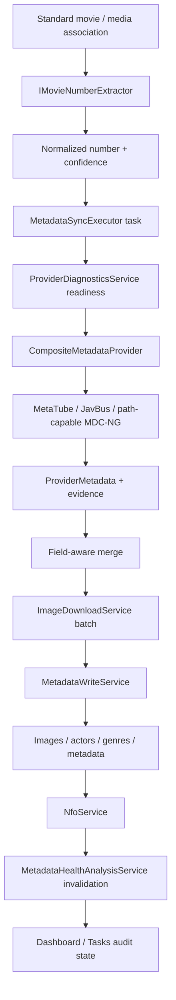

# Local Media Manager v0.7.5 Sync Foundation

**Status:** Self Test and isolated Desktop Smoke passed; production resync and deployment not performed
**Date:** 2026-07-25
**Branch:** `codex/sprint-0.7.5-sync-foundation`
**Base commit:** `6565cca6966a707990ee81aae8c9c01a377fa96d`
**Rollback point:** `daa0f1370309984931c6c9e1447ac3dba843754e`

## Outcome

The Standard metadata path now supports first sync, retry, offline-media number sync, field-targeted completion, Provider fallback, partial image failure, terminal-state separation, and audit evidence without modifying the production database.

The validation used SQLite copies and isolated MediaStorage roots. No production metadata was deleted or resynced. No NAS credential was read, logged, copied, committed, or passed to Docker. The MDC-NG Compose file and NAS mounts remain unchanged.

## Call chain

Primary source chain:

- `MovieNumberExtractor` recognizes and normalizes the code without changing the source filename or media path.
- `MetadataSyncExecutor` creates and resumes the task, classifies `Blocked` and `NoResult`, and preserves user state.
- `ProviderDiagnosticsService` filters unavailable Providers once per session and skips MDC-NG per movie when its path contract is unavailable.
- `CompositeMetadataProvider` applies capabilities, uses configured number aliases, merges field provenance, and stops once requested fields are satisfied.
- `MetadataWriteService` writes normalized metadata and registers every validated `SavedImage`; `Created` only describes whether the file was newly downloaded.
- `NfoService` writes only after useful metadata exists. The health cache is invalidated after a successful write.

## ProviderResult contract

The common result includes:

`Code`, `Title`, `OriginalTitle`, `Actors`, `Genres`, `Director`, `Studio`, `Publisher`, `Series`, `ReleaseDate`, `Duration`, `Plot`, `Rating`, typed image URLs, `SourceUrl`, `ProviderName`, `Confidence`, per-field Provider sources, SHA-256 raw-response evidence, `ErrorCode`, and `ErrorMessage`.

Image candidates also carry their source Provider so the final `Images.SourceProvider` reflects the actual download source. Raw responses are represented by hashes in task evidence; raw cookies, tokens, credentials, and full responses are not persisted in the report.

## Provider capabilities and evidence

| Provider | Current readiness | Real result | Confirmed fields | Limitations |
|---|---|---|---|---|
| MetaTube | Available when the local service is listening on its configured endpoint | 10/10 search and detail parse | Title, original title, actors, genres, director, studio/publisher, series, date, duration, plot, rating, Poster, Fanart, Preview, source URL | Earlier P1 refusal was service availability at the configured loopback endpoint, not a media-path requirement |
| JavBus | Available, site-dependent | 7/10 details parsed | Title, actors, genres, director where present, studio/publisher, series where present, date, duration, Poster, Preview, source URL | No plot or Fanart in the current parser; numeric and FC2 samples may return 404 |
| MDC-NG v1.36.0 | Partial | API health/version reachable; number-only detail 0/10 | Path-task metadata only when a real mapped media task exists | Current API has no independent number-only Search/Detail endpoint; no NAS mount was added |

The former P1 failure had three separate causes:

1. MetaTube was not listening at the configured loopback endpoint, so every per-movie attempt was refused.
2. JavBus site coverage was incomplete, and some Provider codes needed rule-engine aliases such as `259LUXU-752` -> `LUXU-752` and `224DTSL-055` -> `DTSL-055` for equivalence checks.
3. LMM treated MDC-NG as if every Standard movie could enter its path workflow. It now skips only MDC-NG when media is offline or no explicit path mapping exists, while number-based Providers continue.

Readiness now distinguishes `Available`, `Partial`, `Unavailable`, `AuthenticationRequired`, `RateLimited`, `PathMappingMissing`, and `ConfigurationError`. Runtime connection or parser failures suppress repeated calls to that Provider for the current session. HTTP 404 becomes `NoResult`; low-confidence or unrecognized numbers become `Blocked`; successful metadata with skipped file work becomes `CompletedWithWarnings`.

## MDC-NG Number-Only Validation

Container API tested: v1.36.0 on the existing local host port. The test did not mount media and did not use NAS credentials.

| Input | `GET /api/v2/videos/{code}` | `POST /api/tasks/0/restart` with number only | Dependency conclusion |
|---|---:|---:|---|
| SONE-454 | 404 | 404 | No independent number detail |
| ABF-312 | 404 | 404 | No independent number detail |
| THU-063 | 404 | 404 | No independent number detail |
| SPLY-022 | 404 | 404 | No independent number detail |
| WAAA-448 | 404 | 404 | No independent number detail |
| SSNI-624 | 404 | 404 | No independent number detail |
| 259LUXU-752 | 404 | 404 | No independent number detail |
| 224DTSL-055 | 404 | 404 | No independent number detail |
| IPX-123 | 404 | 404 | No independent number detail |
| FC2-PPV-4054910 | 404 | 404 | FC2 number-only unsupported |

Measured GET responses were 2-83 ms; POST responses were 3-13 ms. The restart endpoint returned the same not-found response and did not create a task or manual job. Its number override only applies to an existing path-based task.

The official v1.36.0 GitHub tag exposes documentation and static assets but not the backend implementation, so the conclusion is based on live endpoint behavior, before/after task counts, and the published workflow documentation rather than a backend source audit.

Conclusion:

- General metadata must remain decoupled from media access and use MetaTube/JavBus by normalized number.
- MDC-NG remains `Partial` and is eligible only for an online media path with an explicitly validated mapping.
- No CIFS Volume, Docker credential option, or Compose modification is justified for number metadata.
- Preview/screenshot/duration work that genuinely needs media may be skipped with a warning without failing ordinary metadata sync.

## Merge, Writer, and file evidence

- Provider fields are merged with per-field source attribution and confidence.
- Field-targeted sync stops calling later Providers once all requested fields exist.
- Existing protected/user fields remain unchanged unless an explicitly separate force mode authorizes replacement.
- One corrupt or HTTP 403 image no longer aborts the image batch. Valid fallback candidates are retained and the task becomes `CompletedWithWarnings`.
- Every validated saved image is associated with the current `MovieId`, including an already-existing file; same-movie, same-type, same-path duplicates are suppressed.
- The 3/10/20/50/100 runs produced no duplicate actor or genre associations, no unregistered downloaded resource, and no registered resource missing from the isolated output.
- Retry after cancellation is no longer overwritten by the canceled executor. Host interruption moves active work to `Retrying`; an explicit user cancel remains `Cancelled`.

## Isolated from-zero sync

All runs opened the source database read-only, copied it with SQLite backup, cleared Provider metadata only in the copy, preserved media associations and user data, and wrote to an isolated storage root. Offline/nonexistent media paths were intentionally retained to prove number-based sync does not depend on NAS access.

### Three-record gate

| Metric | Result |
|---|---:|
| Completed | 3/3 |
| Provider/network failures | 0 |
| Images registered | 36 |
| NFO records/files | 3/3 |
| User state preserved | 3/3 |
| SQLite integrity / FK | `ok` / 0 |

### Ten-record acceptance set

Samples covered ordinary codes, long numeric prefixes, different studios, multiple actors, series data, FC2, and number aliases.

| Acceptance metric | Result | Gate |
|---|---:|---:|
| Useful ordinary metadata | 10/10 | >= 8 |
| Actor or Genre | 10/10 | >= 8 |
| Actors | 8/10 | evidence |
| Genres | 9/10 | evidence |
| Poster | 10/10 | >= 8 |
| Fanart | 9/10 | >= 7 |
| Preview | 10/10 | evidence |
| NFO | 10/10 | >= 90% |
| Raw response hash | 10/10 | required audit |
| Duplicate associations | 0 | 0 |
| Unregistered/missing output | 0 / 0 | 0 / 0 |
| Average task time | 8.90 s | observation |

Final statuses were 9 `Completed` and 1 `CompletedWithWarnings`; no item was falsely marked failed or completed without useful data.

## Batch stability

| Batch | Completed | Warnings | No Result | Blocked | Failed | Average | Registered output | User state |
|---:|---:|---:|---:|---:|---:|---:|---:|---:|
| 20 | 15 | 1 | 4 | 0 | 0 | 5.67 s | 231/231 | 20/20 |
| 50 | 39 | 2 | 8 | 1 | 0 | 6.17 s | 574/574 | 50/50 |
| 100 | 81 | 5 | 11 | 3 | 0 | 8.27 s | 1128/1128 | 100/100 |

For the final 100 run, 97 recognized records reached MetaTube and 86 produced accepted metadata. Field targets were then satisfied, so JavBus and MDC-NG were correctly not called. The three `Blocked` records were number-recognition problems, not system failures. SQLite returned `integrity_check=ok` and zero foreign-key errors; NFO records and files were 86/86.

## Startup health regression

The first Release Desktop Smoke exposed a separate startup problem: a local MediaStorage root coexisted with tens of thousands of historical mapped-drive image/NFO paths. Root-only network detection therefore ran synchronous file probes during Dashboard and Settings startup.

The fix detects remote resource paths from the database before inventory, returns a local-only snapshot with `ResourceInventoryComplete=false`, and runs the complete inventory in the cancellable background analysis. Dashboard no longer probes remote cache paths or recent-card resources on its request thread.

The final staged-only rebuild also exposed a packaging reproducibility defect: migration SQL checked out with CRLF produced a different checksum from the identical LF migration recorded in the database. Migration checksums now canonicalize line endings and accept only the LF/CRLF hashes of otherwise identical SQL. A real SQL content change is still rejected. The published Migration executable completed against a byte-identical production database copy with `integrity=ok` and zero foreign-key errors.

Final isolated Release measurements:

| Endpoint/UI | Result |
|---|---:|
| `/health` | 99 ms |
| `/api/settings/all` | 19 ms |
| `/api/dashboard` after full inventory | 321 ms |
| Health analysis state | 2 ms, endpoint responsive |
| Settings page | Opened without timeout |
| Provider settings section | Opened without timeout |
| Bridge status | 0.7.5 connected |

The background physical inventory may still take about one minute when many remote historical paths exist. It no longer blocks Settings or Dashboard; the UI displays `统计中` until the full snapshot replaces the local-only snapshot.

## Resync decision

| Scheme | Scope | Request volume / time | Benefit | Risk | Rollback |
|---|---|---|---|---|---|
| A: fill missing only | Latest evidence pool was 219 eligible Standard records | Lowest | Improves missing fields but leaves inconsistent Provider-era data | Low | Session audit plus DB backup |
| B: clear Provider metadata and resync all | Up to all 1370 Standard records | Highest; at least thousands of requests | Maximum normalization opportunity | High: source coverage varies and current valid data could regress | Requires full DB/resource backup and explicit destructive Dry Run |
| C: target low-quality/anomalous records | Regenerate a plan from Health, NoResult, invalid-resource, and confidence evidence; exclude unresolved number conflicts | Moderate | Focuses requests where measurable benefit exists | Medium-low | Per-session audit and backup |

Recommendation: **Scheme C**. Preserve existing and user data, regenerate a Dry Run against the current 1370 Standard records, and resync only low-quality or anomalous records. Do not clear production Provider metadata. The older audit used different definitions for code mismatch and number anomaly, so the exact C candidate count must come from a fresh plan rather than combining historical counts.

## Tests and builds

| Check | Result |
|---|---|
| New startup/remote-path regression tests | PASS, 3 |
| Migration checksum line-ending tests | PASS, 4/4 |
| Metadata Health focused tests | PASS, 39/39 |
| Bridge Release tests | PASS, 386/386 |
| Bridge Debug build | PASS, 0 warnings/errors |
| Web / TypeScript | PASS |
| Cargo check | PASS |
| Bridge publish | PASS |
| Migration publish | PASS |
| Tauri Release | PASS |
| NSIS | PASS |
| Isolated Desktop Smoke | PASS |
| `git diff --check` | PASS |

Non-blocking build warnings: the existing Vite main chunk exceeds 500 kB, and MSVC reports its existing import-library linker message.

Installer: `src-tauri/target/release/bundle/nsis/Local Media Manager_0.7.5_x64-setup.exe`
Installer size: 30,778,592 bytes
Installer SHA-256: `C46AB9E3A75123BDEB5BFCC1B20C547A6DA0D9C152115E7FA18987B4F850A5C4`

## Known limitations

- MDC-NG number-only metadata is unavailable in the tested v1.36.0 API. Its path mode was not enabled because no NAS mount was approved or needed.
- The final 100-run early-stop behavior primarily exercised MetaTube. JavBus fallback was validated directly on 10 numbers but was not loaded with 100 forced fallback requests.
- Provider websites can still change, rate-limit, geo-block, or return incomplete records. These outcomes are now classified rather than treated as system failures.
- Full physical inventory of remote historical resources remains I/O-bound, but it is asynchronous and cancellable.
- No production resync, production database mutation, deployment, or Human acceptance was performed in this phase.

## Git and rollback

- Final commit subject: `fix(metadata): harden provider sync foundation`
- The immutable commit hash is reported in the final handoff because a commit cannot embed its own hash.
- Git rollback point: `daa0f1370309984931c6c9e1447ac3dba843754e`
- Database rollback point: production database unchanged; isolated copies are disposable.
- Deployment rollback point: none created because deployment was explicitly prohibited.

## Confidence

**94%**

The number-first path, Provider routing, Merge/Writer behavior, image registration, status model, cancellation race, offline media behavior, migration checksum portability, 3/10/20/50/100 isolated runs, 386 automated tests, Release build, NSIS, and staged-only Desktop startup were verified. Remaining uncertainty is external Provider availability and MDC-NG path-only behavior, not the validated number-based pipeline.
